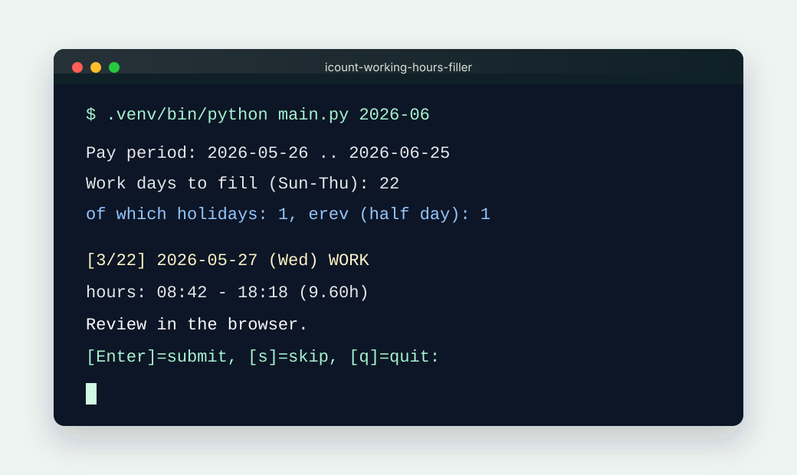
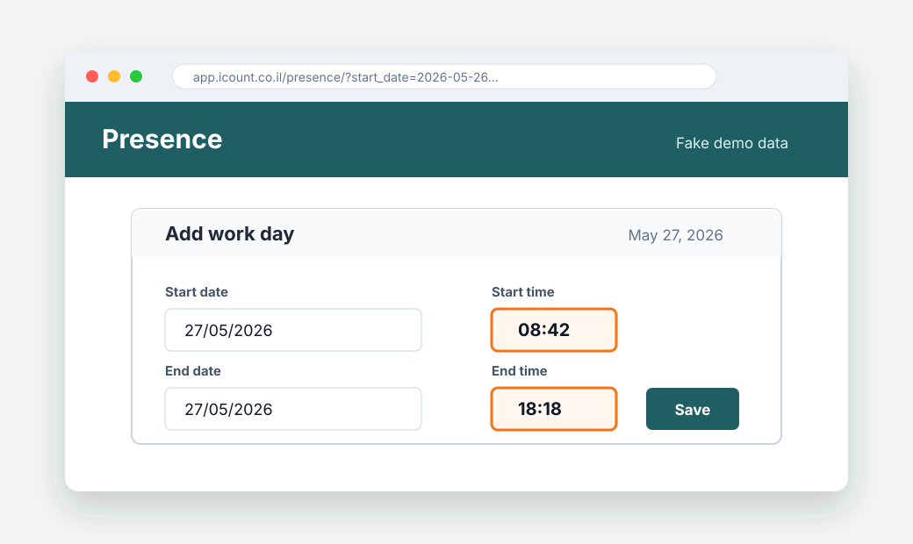
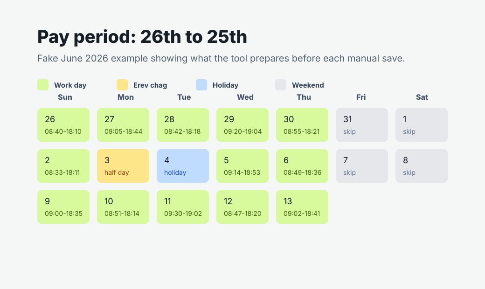
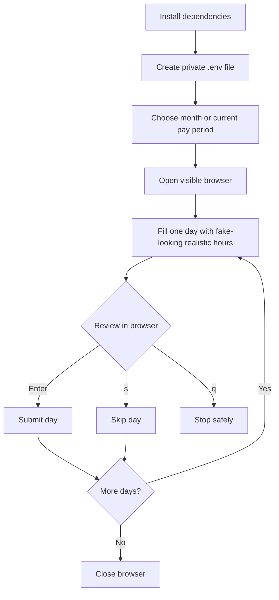

# iCount Working-Hours Filler

[](https://github.com/shakedlieber1/icount-working-hours-filler/actions/workflows/ci.yml)
[](LICENSE)


This is a small helper program that **fills in your monthly working hours on
[app.icount.co.il](https://app.icount.co.il) for you**, automatically.

It opens a real Chrome window so you can watch it work. For every day it types in
realistic hours, then **stops and waits for you to press a key** before it saves
that day. Nothing is saved without your OK.

> Use this only with your own iCount account and only where automated entry is
> allowed by your workplace and the services you use.



---

## Project status

This is a personal automation helper, not an official iCount product. The iCount
web interface can change without notice, so browser selectors may need updates
over time.

| Area | What to know |
| --- | --- |
| Platform | Built for local use with Python 3.12 and Playwright. |
| Browser | Opens a visible Chromium window so you can review every action. |
| Pay period | Fills the 26th of the previous month through the 25th of the selected month. |
| Work week | Defaults to Sunday-Thursday. |
| Safety | Requires your terminal approval before submitting each day. |
| Holiday support | Detects Israeli public holidays and holiday eves offline. |

Security-sensitive local files are intentionally ignored:

- `.env` stores your private credentials.
- `.auth/` stores the local browser profile/session.
- `discovery_output/` may contain screenshots or HTML from authenticated pages.

> [!IMPORTANT]
> Do not commit real screenshots from your logged-in iCount account. The images
> in this README are sanitized mockups with fake dates and fake hours.

## What you will see

The tool has two moving parts: a terminal prompt that asks what to do next, and
a visible browser window where you review the filled fields before anything is
submitted.

| Terminal approval | Browser review |
| --- | --- |
|  |  |

The pay period view is simple: work days are prepared, weekends are skipped, and
holidays or holiday eves get special prompts.



## What it does, in plain words

- It works on one pay period at a time: from the **26th of the previous month**
  to the **25th of the selected month**.
- It only fills **work days (Sunday–Thursday)** and skips Friday/Saturday.
- For each day it picks **random but realistic hours**: starts sometime between
  **08:00 and 10:00**, and works about **9–10 hours** (never less than 8).
- It knows about **Israeli holidays**:
  - On a holiday (like Yom Kippur), it offers to mark the day as a holiday
    ("יום חג") with no hours.
  - On the **eve of a holiday** (erev chag), it offers a **half day (4–7 hours)**.
- **You approve every day** by pressing Enter in the terminal. You can also skip
  a day or stop at any time.

---

## Workflow



> [!NOTE]
> The program does not check whether a day already has hours. If a day is
> already filled in iCount, press `s` to skip it.

## Before you start (one-time checklist)

You need three things:

1. **A Mac or Linux computer** with a terminal. The examples below use macOS
   commands, but the Python workflow is standard.
2. **Python 3.12** installed. To check, open Terminal and run:

   ```bash
   python3.12 --version
   ```

   If it prints something like `Python 3.12.x`, you're good. If it says "command
   not found", install Python 3.12 from [python.org](https://www.python.org/downloads/)
   first. (Note: Python 3.14 does **not** work yet, so please use 3.12.)
3. **Your iCount login**: username, password, and company identifier.
4. **Git**, if you are installing from GitHub:

   ```bash
   git --version
   ```

> Tip: "Terminal" is an app on your Mac. Press `Cmd + Space`, type "Terminal",
> and hit Enter to open it. You type commands there and press Enter to run them.

---

## Setup (do this once)

Copy and paste these commands into Terminal **one block at a time**, pressing
Enter after each.

| Step | Command | Purpose |
| --- | --- | --- |
| 1 | `git clone ...` | Download the project. |
| 2 | `python3.12 -m venv .venv` | Create a private Python workspace. |
| 3 | `.venv/bin/python -m pip install -r requirements.txt` | Install Python packages. |
| 4 | `.venv/bin/python -m playwright install chromium` | Install the browser used by Playwright. |
| 5 | `cp .env.example .env` | Create your private credentials file. |

1. Download the project and go into the folder:

   ```bash
   git clone https://github.com/shakedlieber1/icount-working-hours-filler.git
   cd icount-working-hours-filler
   ```

   If you already downloaded the project another way, just `cd` into that folder.

2. Create a private workspace and install everything the program needs:

   ```bash
   python3.12 -m venv .venv
   .venv/bin/python -m pip install -r requirements.txt
   .venv/bin/python -m playwright install chromium
   ```

   This downloads the tools and a copy of Chrome the program will use. It can
   take a few minutes the first time.

3. Create your private settings file:

   ```bash
   cp .env.example .env
   ```

4. Put your iCount login into that file. Open it with:

   ```bash
   open -e .env
   ```

   A text editor opens. Fill in your details so it looks like this (use your real
   values):

   ```
   ICOUNT_USER=your_username_or_email
   ICOUNT_PASS=your_password
   ICOUNT_COMPANY=your_company_id
   ```

   Save the file (`Cmd + S`) and close the editor.

> Your login stays on your computer in the `.env` file and is never shared or
> uploaded.

> [!WARNING]
> `.env` and `.auth/` are private local files. Keep them off GitHub and avoid
> sharing them in support requests.

---

## How to run it (the everyday command)

In Terminal, from the project folder, run:

```bash
.venv/bin/python main.py
```

The program asks which month to fill:

```text
Which month should I fill? [1-12 or YYYY-MM, Enter=current period]:
```

For example, enter `6` to fill **May 26 through June 25** in the current year.
You can also run the same selection directly from the command line:

```bash
.venv/bin/python main.py 6
.venv/bin/python main.py 2026-06
```

Then a Chrome window opens and logs you in automatically.

> If your account asks for a security code (2FA) or a captcha, just complete it
> in the Chrome window, then come back to the Terminal and press Enter.

Then, for each work day, the program fills the hours and pauses with a question
like this:

```
[3/22] 2026-05-27 (Wed)  WORK
  hours: 08:42 - 18:18  (9.60h)
  Review in the browser. [Enter]=submit, [s]=skip, [q]=quit:
```

Here's what to press:

- **Enter** — looks good, save this day and move to the next one.
- **s** — skip this day (don't save it).
- **q** — stop the program.

When all days are done, press Enter one last time to close the browser.

### Holidays and holiday eves look a little different

On a holiday:

```
[5/22] 2026-09-21 (Mon)  HOLIDAY: יום כיפור
  [Enter]=report as יום חג, [w]=work hours instead, [s]=skip, [q]=quit:
```

- **Enter** — mark the day as a holiday (no work hours).
- **w** — actually, I worked that day; fill normal hours instead.
- **s** / **q** — skip / stop.

On the eve of a holiday (half day):

```
[4/22] 2026-09-20 (Sun)  EREV יום כיפור (half day)
  half-day: 08:50 - 14:10  (5.33h)
  [Enter]=submit half day, [f]=full 9-10h instead, [s]=skip, [q]=quit:
```

- **Enter** — save the half day.
- **f** — make it a full 9–10h day instead.
- **s** / **q** — skip / stop.

> Important: the program does not check whether a day already has hours. If a day
> is already filled in iCount, press **s** to skip it so you don't get duplicates.

---

## Handy extra commands (optional)

See which days will be filled this period:

```bash
.venv/bin/python period.py
.venv/bin/python period.py 6
.venv/bin/python period.py 2026-06
```

See which days are holidays or holiday eves:

```bash
.venv/bin/python holiday_calendar.py             # current period
.venv/bin/python holiday_calendar.py 2026-09-24  # period containing a chosen date
```

---

## If something goes wrong

**"Executable doesn't exist ... Please run: playwright install"**
The browser wasn't downloaded. Run this and try again:

```bash
.venv/bin/python -m playwright install chromium
```

**"command not found: python3.12"**
Python 3.12 isn't installed. Install it from
[python.org](https://www.python.org/downloads/) and redo the Setup steps.

**It can't log in / fields look empty**
Double-check your details in `.env` (open it with `open -e .env`). Make sure
there are no extra spaces and that `ICOUNT_COMPANY` is filled in.

**A day couldn't be filled automatically**
The program will tell you and let you fix it by hand in the Chrome window, then
press Enter to continue (or `s` to skip).

---

## Want to change how it behaves?

All the settings live in [`config.py`](config.py). The most useful ones:

- `START_MIN_MINUTES` / `START_MAX_MINUTES` — the start-time window (default 08:00–10:00).
- `DURATION_MIN_MINUTES` / `DURATION_MAX_MINUTES` — normal day length (default 9–10h).
- `HALF_DURATION_MIN_MINUTES` / `HALF_DURATION_MAX_MINUTES` — holiday-eve half day (default 4–7h).
- `WORK_WEEKDAYS` — which weekdays to fill (default Sunday–Thursday).
- `SLOW_MO_MS` — how slowly the program moves, so you can follow along.
- `HOLIDAY_CATEGORIES` — which holidays count as days off. By default this is the
  main public holidays (Jewish Yom Tov + Independence Day). If you also want
  Memorial Day, Purim, Chol HaMoed, etc. treated as days off, ask for `OPTIONAL`
  to be added here.

---

## Which holidays are recognized

- **Full holidays** (offered as "יום חג"): Rosh Hashana, Yom Kippur, Sukkot,
  Shemini Atzeret / Simchat Torah, Passover (1st and 7th day), Shavuot, and the
  civil **Independence Day**.
- **Holiday eves** (offered as a half day): the work day right before each Jewish
  holiday above. Independence Day has no eve.
- Holiday dates are calculated **on your computer** (no internet lookup needed).

---

## A note on the files (for the curious)

You don't need to touch these, but in case you wonder:

- `main.py` — the program you run.
- `config.py` — all the settings.
- `period.py` — works out the date range.
- `holiday_calendar.py` — works out holidays and holiday eves.
- `discovery.py` — a helper used during development to inspect the iCount page.
- `.env` — your private login (never shared).

---

## Contributing

Contributions are welcome. Please read [`CONTRIBUTING.md`](CONTRIBUTING.md)
before opening a pull request.

The most important rule: keep the manual review-before-submit behavior. The
program may fill forms automatically, but it should not save work days without
an explicit user confirmation.

Before sharing a branch or opening a pull request, run:

```bash
.venv/bin/python -m compileall -q .
```

Do not commit credentials, `.auth/`, screenshots, or HTML captured from an
authenticated iCount page.

## Security

Please do not report credential leaks or account-access bugs in public issues.
Follow [`SECURITY.md`](SECURITY.md) instead.

## License

This project is released under the [MIT License](LICENSE).
